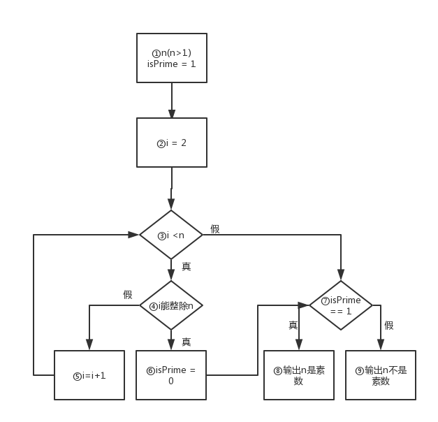

 # CLanguageProgramming_ZJU
自娱自乐，记录自己解答问题的思路，以便于日后总结和提升。
## 章节
* [第1章](#第1章)
* [第2章](#第2章)
* [第3章](#第3章)
* [第4章](#第4章)
* [第5章](#第5章)
* [第6章](#第6章)
* [第7章](#第7章)
* [第7章](#第8章)
* [第9章](#第9章)
* [第10章](#第10章)
* [第11章](#第11章)
* [第12章](#第12章)

## 第1章
1. **对C语言来说,下列标识符中那些是合法的,哪些不是合法的? total, _debug, Larger&Tall, Counter1, begin_**<br/>
Larger&Tall是不合法的，total, _debug, Counter1, begin_是合法的。<br />
* 因为标识符只能由字母，下划线，数字组成
* 标识符只能允许以字母或下划线开头，但不能以数字开头

2. **改写1.4节中的流程图1.2，求1~100中能被6整除的所有整数的和**<br />


3. **改写1.4节中的程序，1~100之间能被6整除的所有整数的和**<br />
```c
#include <stdio.h>

int main() {
	int sum = 0;
	int i;
	for (i=1; i<100; i++) {
		if (i%6 == 0) {
			printf("i=%d sum=%d\n", i, sum);
			sum += i;
		}
	}
	printf("sum=%d\n", sum);
	return 0;
} 
```

4. **对于给定的整数n(n>1)，请设计一个流程图判别n是否为素数（只能被1和自己整除的整数），并分析流程图哪些是顺序结构、分支结构与循环结构**<br />
<br />
①②是顺序结构 ③④⑤⑥是循环结构 ④⑤⑥和⑦⑧⑨是分支结构
## 第2章

## 第3章

## 第4章

## 第5章

## 第6章

## 第7章

## 第8章

## 第9章

## 第10章

## 第11章

## 第12章
